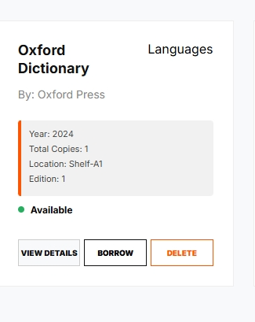

# Library Management System
## Overview

An educational Electronic Library Management System built entirely using Vanilla TypeScript, HTML, and CSS.
This project demonstrates core Object-Oriented Programming (OOP) principles such as:

Encapsulation (private fields # and getters)
Abstraction (controlled access to data via methods)
Inheritance (ReferenceBook extends Book)
Polymorphism (displayInfo() override in ReferenceBook)

The system allows users to manage a collection of books, including specialized reference materials with location codes and editions.

---
# Features

Display books as cards with Title, Author, Category, Availability
Search books by title or author
Filter books by category using a dropdown
Change availability (Borrow/Return)
Delete books
Add new books via a modal form
Reference books display additional info (Location Code & Edition)
Responsive UI with modern layout and interactive cards

---
# Project Structure
``` bash
task-1-adv/
│
├── index.html          # Main interface
├── style.css           # Styles for layout and cards
├── app.ts              # Main TypeScript logic
├── Book.ts             # Book class (base class)
├── ReferenceBook.ts    # ReferenceBook class (extends Book)
├── Library.ts          # Library class (manages collection)
├── BookCategory.ts     # Enum for book categories
├── screenshots/        # Screenshots for README
└── README.md          
```
---
# Installation
## Prerequisites

Make sure you have Node.js and TypeScript installed:

npm install -g typescript

Setup & Run

# Clone the repository
git clone https://github.com/ayazeabali/task-1-adv.git

# Navigate to project directory
cd task-1-adv

# Compile TypeScript to JavaScript
tsc app.ts

---

##  Home Screen


---

##  Add Book


---

##  View Details



---
