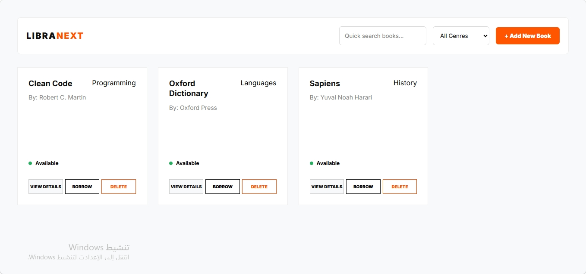
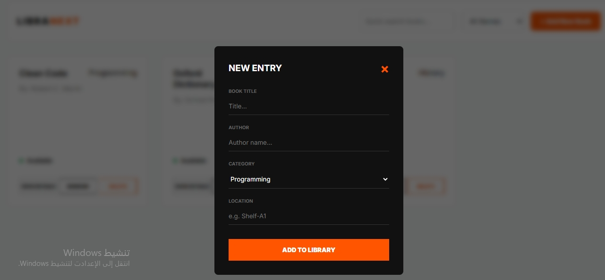

#  Library Management System 

##  Overview
An educational Electronic Library Management System built from scratch using **Vanilla TypeScript**. This project focuses on implementing core **Object-Oriented Programming (OOP)** principles to manage a collection of books, including specialized reference materials.

---

## Installation

Follow these steps to run the project locally:

### 1. Prerequisites
Ensure you have the TypeScript compiler installed:
```bash
npm install -g typescript
2. Setup & Execution
# Clone the repository
git clone [https://github.com/YOUR_USERNAME/task-1-adv.git](https://github.com/YOUR_USERNAME/task-1-adv.git)

# Navigate to project directory
cd task-1-adv

# Compile TypeScript to JavaScript
tsc app.ts


📸 Screenshots:
### Home Screen


### Add Book


### View Details

